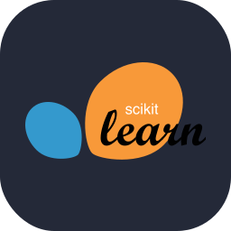
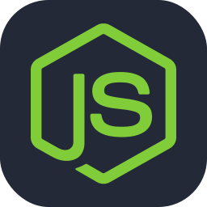
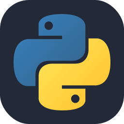
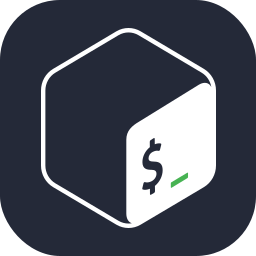
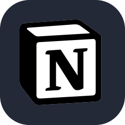

### Data and Artificial Intelligence Engineer

 

##  About Me

- **Data and Artificial Intelligence Engineer** with hands-on experience across data pipelines, automation, LLMs, and BI-focused visualization.
- Currently a **MSITM student in The University of Texas at Austin**.
- Background spans ETL pipeline development, Retrieval-Augmented Generation chatbots, prompt engineering, and dashboarding with Looker & Databricks.
- Proven leadership organizing technical events and consulting on data-driven solutions for creative industries.
- Check out my full [resume](https://xilenatenea.onrender.com/) for the complete picture.

 

##  Languages

- 🇬🇧 English — C1
- 🇪🇸 Spanish — Native

 

##  Tech Stack

  
  
  
  
  
  
  
   
  
  
  
  
  
  
  
   
  
  
  
  
  
  
  
   
  
  
  

 

##  Let's Connect

---

Thanks for stopping by — see the full <a href="https://xilenatenea.onrender.com/">resume</a> for more details.

